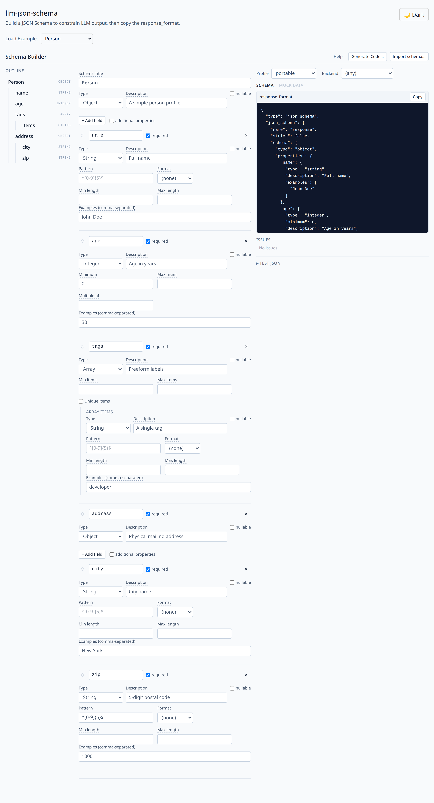

# llm-json-schema

Build a **JSON Schema** that describes the object you want an LLM to return, then
use it to constrain output on **OpenAI-compatible guided-decoding endpoints**
(vLLM, llama.cpp) running models like gemma-4, nemotron-3, or qwen-3.6.

- **Framework-free core** — compile a small editor model to JSON Schema +
  an OpenAI `response_format`, parse an existing schema back, and lint it against
  specific decoding backends.
- **Optional React UI** — a visual builder (`llm-json-schema/react`) for people
  with light programming knowledge. React is an optional peer dependency.

> The repo directory is historically named `openapi-gui`, but the package targets
> **JSON Schema**, not OpenAPI.

## Install

The package is published to the **GitHub Packages** npm registry, so point the
`@brishen` scope at it first:

```sh
echo "@brishen:registry=https://npm.pkg.github.com" >> .npmrc
npm install @brishen/llm-json-schema
# React UI is optional; bring your own React 18/19:
npm install react react-dom
```

Installing from GitHub Packages requires authenticating `npm` with a GitHub
token that has `read:packages` (see [Releasing](#releasing)).

## Core usage (no framework)

```ts
import {
  objectNode,
  stringNode,
  integerNode,
  arrayNode,
  property,
  compile,
} from 'llm-json-schema';

const model = objectNode({
  title: 'Person',
  properties: [
    // `examples` are emitted as the JSON Schema `examples` annotation and help
    // the model fill the field:
    property('name', stringNode({ description: 'Full name', examples: ['Ada Lovelace'] })),
    property('age', integerNode({ description: 'Age in years', minimum: 0 })),
    property('tags', arrayNode(stringNode())),
    // optional field:
    property('nickname', stringNode(), /* required */ false),
  ],
});

const { schema, responseFormat, issues } = compile(model, {
  profile: 'portable', // or 'strict'
  name: 'person',
});
```

Drop `responseFormat` straight into a chat-completions request:

```ts
await fetch('http://localhost:8000/v1/chat/completions', {
  method: 'POST',
  headers: { 'Content-Type': 'application/json' },
  body: JSON.stringify({
    model: 'gemma-4',
    messages: [{ role: 'user', content: 'Describe Ada Lovelace.' }],
    response_format: responseFormat,
  }),
});
```

### Compile profiles

Guided-decoding backends support different slices of JSON Schema, so `compile`
offers two shapes:

| Profile              | Optional properties                                  | `additionalProperties`           | `strict` |
| -------------------- | ---------------------------------------------------- | -------------------------------- | -------- |
| `portable` (default) | omitted from `required`                              | `false` (your choice per object) | `false`  |
| `strict` (OpenAI)    | listed in `required`, type widened to `["T","null"]` | forced `false` on every object   | `true`   |

Use `portable` for the broadest backend compatibility (xgrammar / outlines /
llama.cpp GBNF). Use `strict` when targeting OpenAI strict structured outputs.

### Round-trip an existing schema

```ts
import { parse, compile } from 'llm-json-schema';

const { node, unsupported } = parse(existingJsonSchema);
// `unsupported` lists keywords the model doesn't represent (warn, don't drop).
const { schema } = compile(node, { profile: 'portable' });
```

The portable round-trip (`parse(compile(model).schema)`) reproduces the model for
supported features. The strict profile's optional-encoding is inherently
ambiguous with a required-nullable property, so a strict-compiled optional field
round-trips as required-nullable.

### Lint against a backend

```ts
import { lint } from 'llm-json-schema';

const problems = lint(node, { backend: 'llamacpp' });
// e.g. warns that `pattern` is unsupported and `format` is ignored on llama.cpp,
// plus quality nudges like "this field has no description".
```

## React UI



```tsx
import { SchemaBuilder } from 'llm-json-schema/react';
import 'llm-json-schema/styles.css'; // prebuilt — no Tailwind setup needed

export function App() {
  return <SchemaBuilder defaultValue={/* optional initial model */ undefined} />;
}
```

`<SchemaBuilder>` works controlled (`value` + `onChange`) or uncontrolled
(`defaultValue`). It shows a node-tree editor on the left and the live JSON
Schema + `response_format` + lint issues on the right, with an import dialog for
pasting an existing schema.

Prefer your own UI? Use the headless hook:

```tsx
import { useSchemaBuilder } from 'llm-json-schema/react';

const { model, dispatch, output, issues } = useSchemaBuilder({
  profile: 'strict',
  backend: 'vllm-xgrammar',
});
```

All UI classes are prefixed `lss-` to avoid collisions in host apps.

## Development

```sh
npm run dev        # demo playground (src/demo) on the Vite dev server
npm test           # vitest: compile, round-trip, Ajv validation, lint rules
npm run test:e2e   # playwright: drives the demo GUI in a browser
npm run typecheck  # tsc -b
npm run lint       # eslint
npm run build      # library ESM build (dist/) + prebuilt dist/styles.css
```

> Playwright needs a browser: `npx playwright install chromium`. The e2e config
> boots the Vite dev server itself. Regenerate the screenshot above with
> `node scripts/screenshot.mjs` while the dev server is running.

### Verifying against a real backend (manual)

Start a local vLLM or llama.cpp OpenAI server, POST the generated
`response_format`, and confirm the completion parses against `schema` (e.g. with
Ajv). This step is documented rather than automated.

## Releasing

The package is published to the **GitHub Packages** npm registry by
`.github/workflows/publish.yml`, which runs when a GitHub Release is published.
The release tag drives the published version, so keep the tag and
`package.json` version in sync by letting `npm version` create both:

```sh
git checkout main && git pull
npm version minor          # bumps package.json, commits, and tags vX.Y.Z
                           # use patch | major, an explicit number, or
                           # `npm version prerelease --preid=rc` for prereleases
git push --follow-tags     # push the commit and the tag together

# Create the Release from that tag — this triggers the publish workflow:
gh release create "v$(node -p "require('./package.json').version")" --generate-notes
```

For the **first** release, use an explicit number (`npm version 0.1.0`) since the
repo starts at `0.0.0`.

Consumers install from the GitHub registry with an `.npmrc` that maps the scope:

```sh
echo "@brishen:registry=https://npm.pkg.github.com" >> .npmrc
npm install @brishen/llm-json-schema
```

## License

MIT
